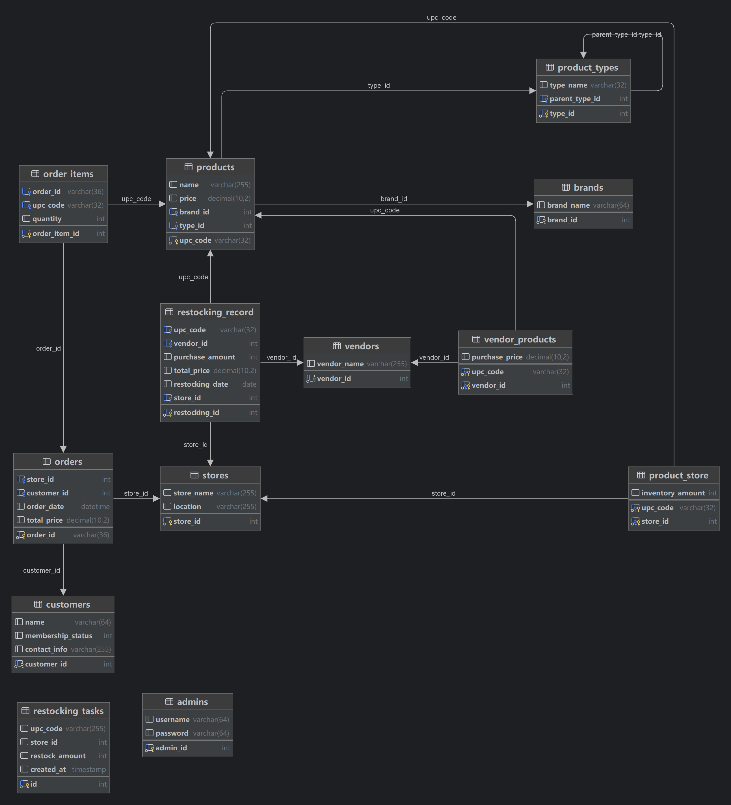
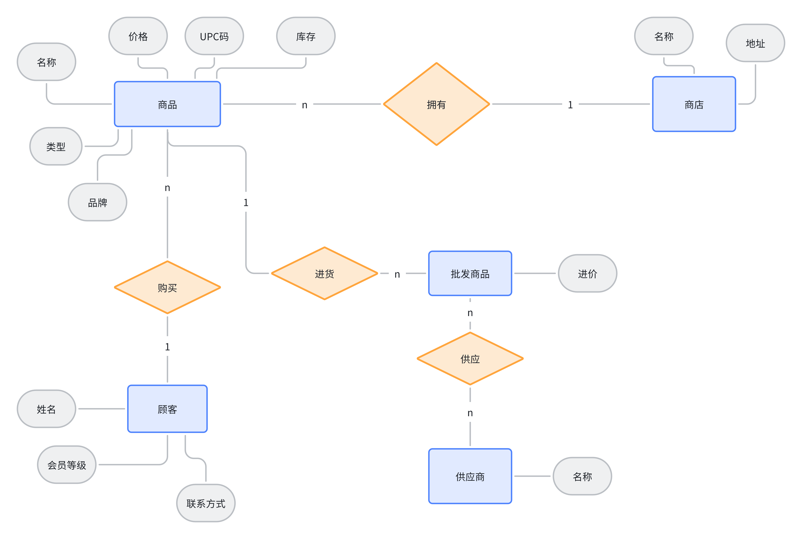

# cargo-manage-system 货物管理系统



该系统实现了前端、后端和底层数据库三个层次的功能。通过前端，管理员可以便捷对货物进行进货等管理操作。后端使用`go`进行开发，支持并发操作数据库。底层数据库使用`MySQL`。
使用方法：

1. 填写[`config.json`](/config.json)，在配置文件中写入MySQL账户和密码。
2. 点击`cargo-manage-system.exe`运行。
3. 浏览器打开`127.0.0.1:8080`进入到登录页面。
4. 输入账号密码，进入管理系统。

---

## 详细解读

### E-R图



### 实现

通过后端实现与底层数据库的交互功能。具体行为如下：

#### 购买

由于购买和管理员行为无关，所以没有设计管理员界面。购买行为通过直接的API访问实现。购买模拟的是在收银台的操作，每次购买为一整个事务，购买结账时事务结束提交。

1. 开始购买，访问`/customer/purchase/begin`路由，会生成一个UUID码作为购买记录的主键。
2. 添加商品，访问`/customer/purchase/add`路由，传入UUID码，将购买记录写入到事务中，通过外键和购买记录关联。每次添加商品会触发一个触发器，自动减少商品的库存。
3. 结束购买，访问`/customer/purchase/end`路由，传入UUID码，结束购买行为，提交事务。

#### 进货与自动进货自动进货

后台管理系统提供当货物不足时自动进货的功能。自动进货通过一个事件和一系列的触发器实现。触发器的逻辑构建代码如下：

```sql
DECLARE existing_task INT;
SELECT COUNT(*) INTO existing_task FROM Restocking_Tasks
WHERE upc_code = NEW.upc_code AND store_id = NEW.store_id; 
IF NEW.store_id = [自动进货商店ID] 
AND NEW.upc_code = [自动进货商品UPC码] 
AND NEW.inventory_amount < [自动进货库存阈值] AND existing_task = 0 THEN 
INSERT INTO Restocking_Tasks (upc_code, store_id, restock_amount) 
VALUES (NEW.upc_code, NEW.store_id, [进货数量]); 
END IF;
```

这个触发器会在指定商品的库存数量小于指定数量时，向进货计划表插入一个指定进货数量的订单。在每天0点，事件会扫描进货计划表，将进货计划表内的进货计划转移到进货表内。

事件的sql代码如下:

```sql
create definer = root@localhost event restock_products on schedule
    every '1' DAY
        starts '2024-06-06 15:36:27'
    enable
    do
    BEGIN
        INSERT INTO Restocking_Record (upc_code, vendor_id, 
purchase_amount, total_price, restocking_date, store_id)
        SELECT upc_code,
               (SELECT vendor_id FROM Vendor_Products 
WHERE upc_code = Restocking_Tasks.upc_code ORDER BY purchase_price LIMIT 1),
               restock_amount,
               restock_amount * (SELECT purchase_price FROM 
Vendor_Products WHERE upc_code = Restocking_Tasks.upc_code ORDER BY purchase_price LIMIT 1),
               NOW(),
               store_id
        FROM Restocking_Tasks;

        DELETE FROM Restocking_Tasks;
    END;
```

同时，当进货计划表有插入行为时，会触发一个触发器，自动增加库存，该触发器的代码如下：
```sql
CREATE TRIGGER update_inventory
    AFTER INSERT ON Restocking_Record
    FOR EACH ROW
BEGIN
    DECLARE original_inventory INT;

    -- 先查询当前库存量
    SELECT inventory_amount INTO original_inventory
    FROM Product_Store
    WHERE upc_code = NEW.upc_code AND store_id = NEW.store_id;

    -- 如果没有找到记录，则进行插入操作
    IF original_inventory IS NULL THEN
        INSERT INTO Product_Store (upc_code, store_id, inventory_amount)
        VALUES (NEW.upc_code, NEW.store_id, NEW.purchase_amount);
    ELSE
        -- 如果找到了记录，则进行更新操作
        UPDATE Product_Store
        SET inventory_amount = original_inventory + NEW.purchase_amount
        WHERE upc_code = NEW.upc_code AND store_id = NEW.store_id;
    END IF;
END;
```

#### 一些查询代码:

1. 查询销量最高的前三项商品：
```sql
SELECT
    p.upc_code,
    p.name,
    SUM(oi.quantity) AS total_quantity_sold
FROM
    Order_Items oi
        JOIN
    Products p ON oi.upc_code = p.upc_code
GROUP BY
    p.upc_code,
    p.name
ORDER BY
    total_quantity_sold DESC
LIMIT 3;

```

2. 查询销量最高的前三家商店
```sql
SELECT
    s.store_id,
    s.store_name,
    SUM(o.total_price) AS total_sales
FROM
    Orders o
        JOIN
    Stores s ON o.store_id = s.store_id
GROUP BY
    s.store_id,
    s.store_name
ORDER BY
    total_sales DESC
LIMIT 3;
```

3. 查询购买量最多的前三位顾客
```sql
SELECT
    c.customer_id,
    c.name,
    SUM(oi.quantity) AS total_quantity_purchased
FROM
    Order_Items oi
        JOIN
    Orders o ON oi.order_id = o.order_id
        JOIN
    Customers c ON o.customer_id = c.customer_id
GROUP BY
    c.customer_id,
    c.name
ORDER BY
    total_quantity_purchased DESC
LIMIT 3;
```